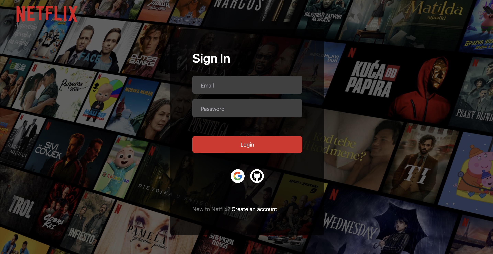

After playing around with Tailwind in some work-related projects, i wanted to explore more of what it could offer and how i could utilise it better for my other projects. So this website was based off [this popular tutorial](https://www.youtube.com/watch?v=mqUN4N2q4qY&ab_channel=CodeWithAntonio).



I was pretty impressed how quickly i could make progress with a basic understanding of tailwind classes and utilities, even if it was just scratching the surface:

A live version of this can be found here:
https://netflix-clone-khaki-mu.vercel.app/